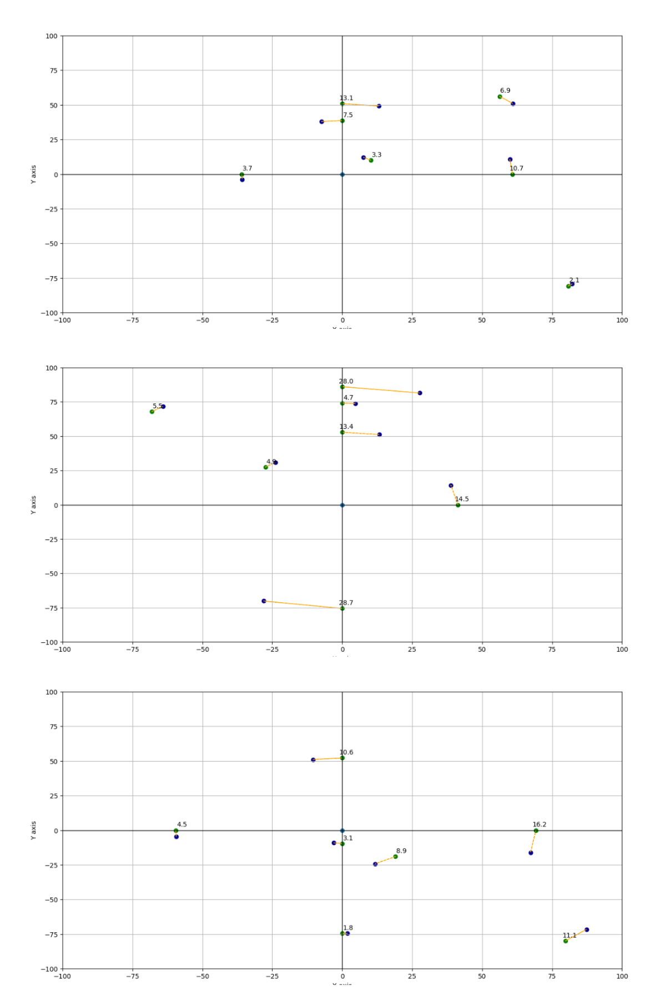
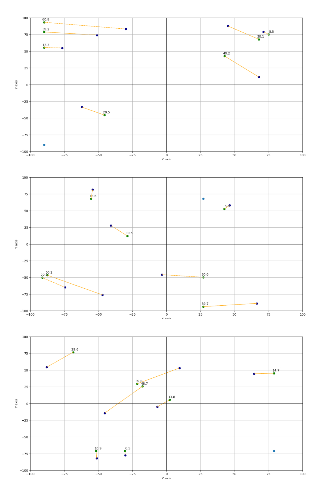

# Cardinal Direction Accuracy Tester

The Direction and Distance Accuracy Tester is a Python project that allows you to see how accurate an approximation of a friend's location can be when you only know their distance and cardinal direction from your own location. Developed in VSCode.

# Explanation and Objective  

The project takes as input the coordinates of your location and your friends' on a 2D grid. Then performs trigonometric calculations and basic linear algebra to estimate the position of your friend on the grid based on the given data. A plot is then generated to show how accurate the estimate is, by displaying the actual position of your friend, your estimated position of your friend, and the distance between the two.   

This project can be helpful in demonstrating the limitations of using cardinal directions and distances to approximate the location of a friend (or anything else) that can be given in a talkable languaje, and the importance of having more precise location data to ensure accuracy. It can also be used to showcase the application of trigonometry in real-world scenarios.  

To understand how the program works, it's important to know that it uses the following cardinal directions: N, NW, W, SW, S, SE, E, and NE. Once the cardinal direction of a friend is determined, the algorithm approximates their position as if you were to travel directly along the cardinal line that passes closest to their coordinates. The algorithm uses the radius given by the distance calculation to determine the endpoint of this line. Therefore, the closer a friend is to a cardinal direction line, the more accurate the prediction will be.

# Simulations: Accurate or Inaccurate?
In the visual representations of the project, my position is shown as a light blue point, while your friends' actual positions are shown as dark blue points. The approximations of their positions are shown as green points, with the distance of the approximation displayed as a number next to them.

- **Plots with my coords positioned at (0,0)**  

  

It can be observed that when we are located at the center of the plane, approximations of friends' positions are generally accurate. However, when we are closer to the sides or corners of the plane, the accuracy of approximations decreases.

- **Plots with my coords randomly positioned**  

  

This decrease in accuracy can be attributed to the fact that friends' coordinates may be located on the opposite side or space from where we are standing. As a result, the straight lines of the cardinal directions become increasingly more apart from each other as we look further, and position predictions become less accurate.